ggplot: Lexis Surface Plots and the Effective Use of Color
================
Jonas Schöley
June 19, 2017

-   [Lexis Surfaces in GGplot](#lexis-surfaces-in-ggplot)
    -   [nxm year data](#nxm-year-data)
    -   [Discrete Period and Age Scales](#discrete-period-and-age-scales)
-   [Divergent Colour Scales: Plotting Differences & Proportions](#divergent-colour-scales-plotting-differences-proportions)
-   [Qualitative Colour Scales: Plotting Group Membership](#qualitative-colour-scales-plotting-group-membership)
-   [Using area instead of colour](#using-area-instead-of-colour)
-   [Further Reading](#further-reading)

``` r
library(tidyverse)
```

    ## Loading tidyverse: ggplot2
    ## Loading tidyverse: tibble
    ## Loading tidyverse: tidyr
    ## Loading tidyverse: readr
    ## Loading tidyverse: purrr
    ## Loading tidyverse: dplyr

    ## Conflicts with tidy packages ----------------------------------------------

    ## filter(): dplyr, stats
    ## lag():    dplyr, stats

Lexis Surfaces in GGplot
------------------------

Lexis surfaces show the value of a third variable on a period-age-grid. If the value of the third variable is given via colour the resulting plot is known as "Heatmap" and used in many disciplines. In ggplot we produce heatmaps using `geom_tile()` or `geom_rect()`. These geometries draw rectangles at specified xy-positions. By default all rectangles are equal in size. They can be coloured according to some variable in the data.

`geom_rect()` is faster and produces smaller pdf's, while `geom_tile()` allows to specify the dimensions of the rectangles making it useful for data that does not come in single year period and age intervals.

For now we will ignore the colouring aspect and just look at how ggplot draws rectangles. \#\#\# 1x1 year data We work with data from the [Human Mortality Database](http://www.mortality.org) -- Swedish period mortality rates by sex.

``` r
swe <- read_csv("mortality_surface_sweden.csv")
```

    ## Parsed with column specification:
    ## cols(
    ##   Country = col_character(),
    ##   Timeframe = col_character(),
    ##   Sex = col_character(),
    ##   Year = col_integer(),
    ##   Age = col_integer(),
    ##   Dx = col_double(),
    ##   Nx = col_double(),
    ##   mx = col_double()
    ## )

``` r
head(swe)
```

    ## # A tibble: 6 x 8
    ##   Country Timeframe    Sex  Year   Age      Dx       Nx      mx
    ##     <chr>     <chr>  <chr> <int> <int>   <dbl>    <dbl>   <dbl>
    ## 1     SWE    Period Female  1751     0 5988.00 28214.05 0.21223
    ## 2     SWE    Period   Male  1751     0 6902.00 28626.58 0.24110
    ## 3     SWE    Period Female  1751     1 1286.45 26035.03 0.04941
    ## 4     SWE    Period   Male  1751     1 1359.88 25682.81 0.05295
    ## 5     SWE    Period Female  1751     2  834.56 25880.11 0.03225
    ## 6     SWE    Period   Male  1751     2  882.13 25504.40 0.03459

Only specifying x and y position and omitting colour puts a grey rectangle at every xy position that appears in the data. The resulting plot gives us information about the period-ages where we have mortality data on Swedish females.

``` r
swe %>% filter(Sex == "Female") %>%
  ggplot() +
  geom_tile(aes(x = Year, y = Age))
```

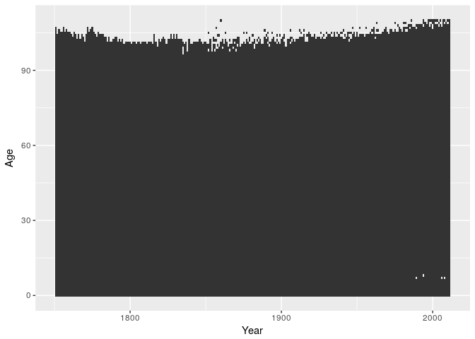

When constructing Lexis surfaces it is a good idea to use isometric scales. The distance corresponding to a single year should be the same on the x and the y scales (a 1x1 rectangle should actually be a square). We can force such an equality by adding a suitable coordinate layer.

``` r
swe %>% filter(Sex == "Female") %>%
  ggplot() +
  geom_tile(aes(x = Year, y = Age)) +
  coord_equal()
```

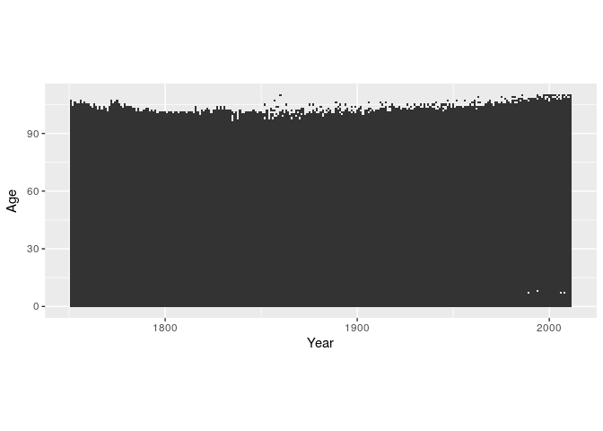

By default the small rectangles have a width and height of 1 scale unit and are drawn over the mid-points of the corresponding x and y values.

``` r
swe %>% filter(Sex == "Female") %>%
  ggplot() +
  geom_tile(aes(x = Year, y = Age), colour = "white") +
  scale_x_continuous(breaks = 1800:1810) +
  scale_y_continuous(breaks = 100:110) +
  coord_equal(xlim = c(1800, 1810), ylim = c(100, 110))
```

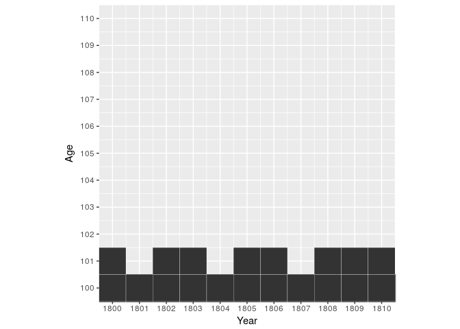

Shifting the data by 0.5 in x and y aligns things neatly.

``` r
swe %>% filter(Sex == "Female") %>%
  mutate(Year = Year + 0.5, Age = Age + 0.5) %>%
  ggplot() +
  geom_tile(aes(x = Year, y = Age), colour = "white") +
  scale_x_continuous(breaks = 1800:1810) +
  scale_y_continuous(breaks = 100:110) +
  coord_equal(xlim = c(1800, 1810), ylim = c(100, 110))
```

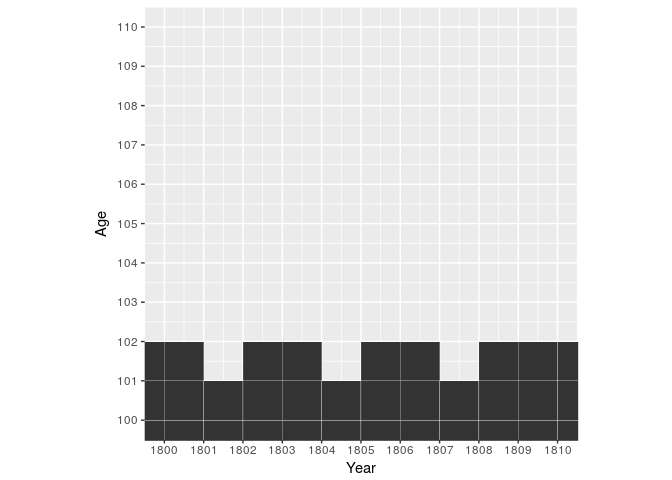

### nxm year data

If our data does not come in single year and age groups we have to adjust the `width` and/or `height` of the rectangles. `width` and `height` are regular aesthetics and can be mapped to variables in the data.

``` r
cod <- read_csv("cod.csv")
```

    ## Parsed with column specification:
    ## cols(
    ##   Year = col_integer(),
    ##   Age = col_integer(),
    ##   AgeGr = col_character(),
    ##   w = col_integer(),
    ##   Sex = col_character(),
    ##   COD = col_character()
    ## )

``` r
head(cod)
```

    ## # A tibble: 6 x 6
    ##    Year   Age AgeGr     w    Sex   COD
    ##   <int> <int> <chr> <int>  <chr> <chr>
    ## 1  1925     0    <1     1 Female Other
    ## 2  1925     0    <1     1   Male Other
    ## 3  1925     1   1-4     4 Female Other
    ## 4  1925     1   1-4     4   Male Other
    ## 5  1925     5   5-9     5 Female Other
    ## 6  1925     5   5-9     5   Male Other

The Cause of Death data features age groups of different sizes (1, 4, or 5 years). This is how it looks like if we plot it without any regard to the size of the age groups.

``` r
cod %>% filter(Sex == "Female") %>%
  mutate(Year = Year + 0.5) %>%
  ggplot() +
  geom_tile(aes(x = Year, y = Age),
            colour = "white") +
  coord_equal()
```

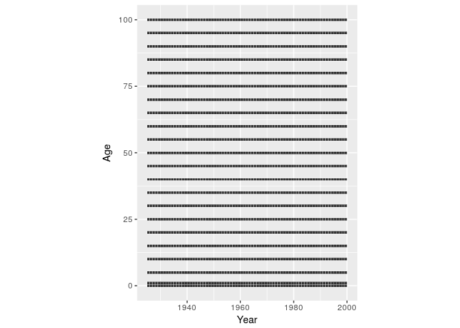

Now we shift the rectangles away from the age midpoint and scale them in height according to the width of the age group.

``` r
cod %>% filter(Sex == "Female") %>%
  mutate(Year = Year + 0.5, Age = Age + w/2) %>%
  ggplot() +
  geom_tile(aes(x = Year, y = Age, height = w),
            colour = "white") +
  coord_equal()
```

    ## Warning: Ignoring unknown aesthetics: height

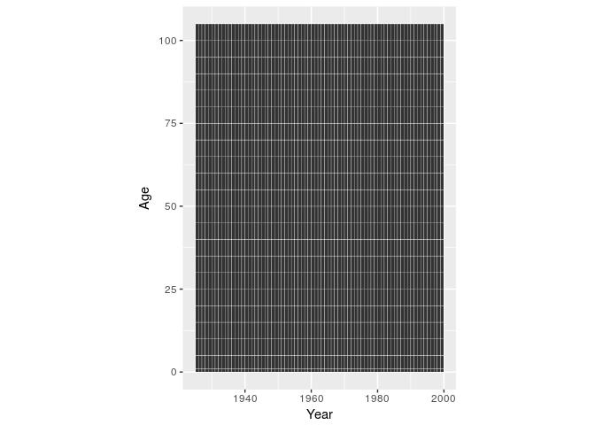

### Discrete Period and Age Scales

If we use discrete axis (happens automatically if we supply a non-numeric variable to the x or y aesthetic) we loose any control over the placement of the age or period groups. They will be equally spaced along the axis.

``` r
cod %>% filter(Sex == "Female") %>%
  mutate(Year = Year + 0.5, Age = AgeGr) %>%
  ggplot() +
  geom_tile(aes(x = Year, y = Age), colour = "white") +
  coord_equal()
```

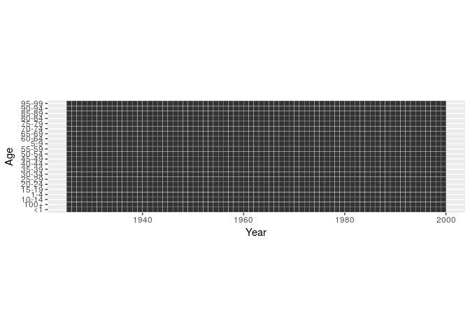

**Avoid character or factor variables as your period or age groups.** Whenever possible go with numeric "Start of Interval" and "Interval Width" variables. \#\# Sequential Colour Scales: Plotting Magnitudes If we plot magnitudes we would like to use a colour scale which has an intrinsic ordering to it. Scales that vary from dark to light are suitable and we call them "sequential". `scale_fill_brewer(type = "seq")` provides you with such a scale.

``` r
breaks_mx <- c(0, 0.0001, 0.001, 0.01, 0.1, Inf)
swe %>%
  mutate(Year = Year + 0.5, Age = Age + 0.5,
         mx_cut = cut(mx, breaks = breaks_mx)) %>%
  ggplot() +
  geom_tile(aes(x = Year, y = Age, fill = mx_cut)) +
  scale_fill_brewer(type = "seq") +
  facet_wrap(~Sex, ncol = 1) +
  guides(fill = guide_legend(reverse = TRUE)) +
  coord_equal()
```

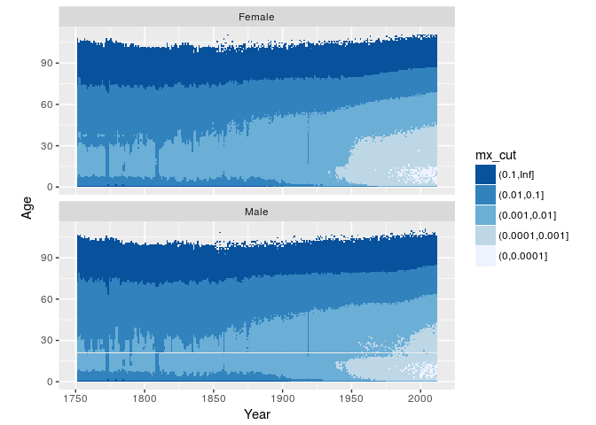

Continuous colour scales take the form of a smooth colour gradient. Getting the gradient to look like you want can be tricky.

``` r
swe %>%
  mutate(Year = Year + 0.5, Age = Age + 0.5) %>%
  ggplot() +
  geom_tile(aes(x = Year, y = Age, fill = mx)) +
  scale_fill_distiller(type = "seq", palette = "PuBuGn") +
  facet_wrap(~Sex, ncol = 1) +
  coord_equal()
```

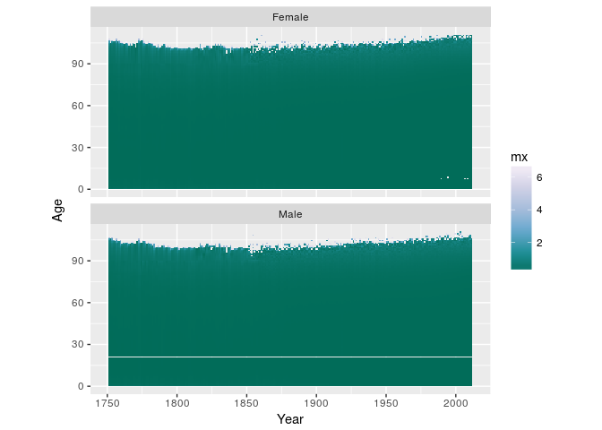

Log transform the colour scale.

``` r
swe %>%
  mutate(Year = Year + 0.5, Age = Age + 0.5) %>%
  ggplot() +
  geom_tile(aes(x = Year, y = Age, fill = mx)) +
  scale_fill_distiller(type = "seq", palette = "PuBuGn", trans = "log10") +
  facet_wrap(~Sex, ncol = 1) +
  coord_equal()
```

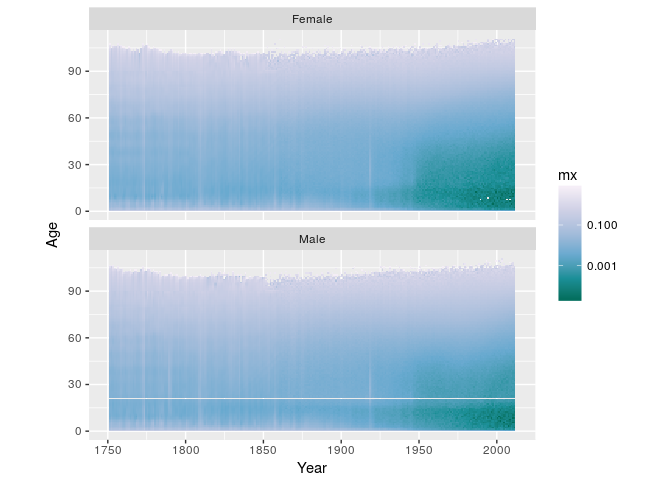

Make high values dark and low values light.

``` r
swe %>%
  mutate(Year = Year + 0.5, Age = Age + 0.5) %>%
  ggplot() +
  geom_tile(aes(x = Year, y = Age, fill = mx)) +
  scale_fill_distiller(type = "seq", palette = "PuBuGn", trans = "log10",
                       direction = 1) +
  facet_wrap(~Sex, ncol = 1) +
  coord_equal()
```

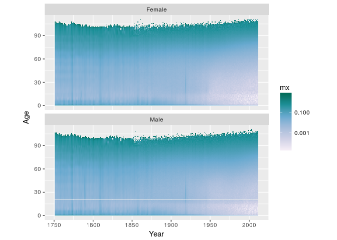

Rescale the colour gradient to increase contrast.

``` r
swe %>%
  mutate(Year = Year + 0.5, Age = Age + 0.5) %>%
  ggplot() +
  geom_tile(aes(x = Year, y = Age, fill = mx)) +
  scale_fill_distiller(type = "seq", palette = "PuBuGn", trans = "log10",
                       direction = 1,
                       values = c(0, 0.3, 0.4, 0.5, 0.6, 1)) +
  facet_wrap(~Sex, ncol = 1) +
  coord_equal()
```

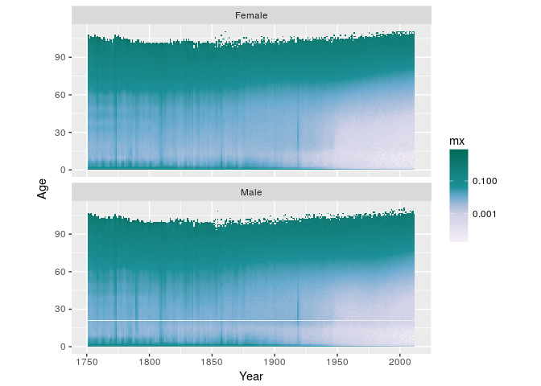

Throw away data outside of the limits.

``` r
swe %>%
  mutate(Year = Year + 0.5, Age = Age + 0.5) %>%
  ggplot() +
  geom_tile(aes(x = Year, y = Age, fill = mx)) +
  scale_fill_distiller(type = "seq", palette = "PuBuGn", trans = "log10",
                       direction = 1,
                       values = c(0, 0.3, 0.4, 0.5, 0.6, 1),
                       limits = c(0.001, 0.5)) +
  facet_wrap(~Sex, ncol = 1) +
  coord_equal()
```

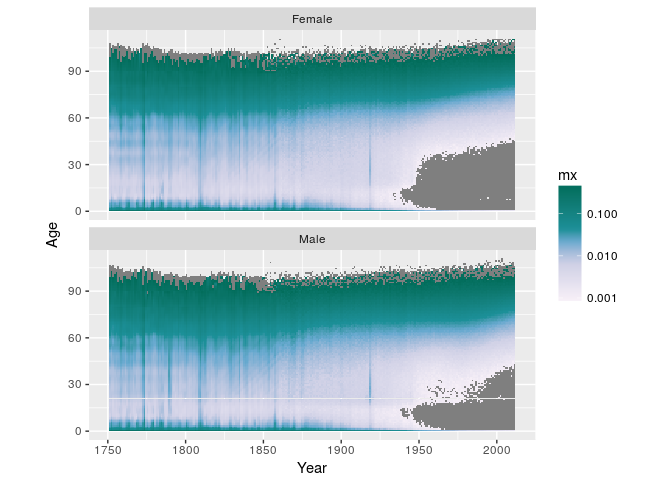

Or instead *squish* the out-of-bounds data into the limits.

``` r
swe %>%
  mutate(Year = Year + 0.5, Age = Age + 0.5) %>%
  ggplot() +
  geom_tile(aes(x = Year, y = Age, fill = mx)) +
  scale_fill_distiller(type = "seq", palette = "PuBuGn", trans = "log10",
                       direction = 1,
                       values = c(0, 0.3, 0.4, 0.5, 0.6, 1),
                       limits = c(0.001, 0.5),
                       oob = scales::squish) +
  facet_wrap(~Sex, ncol = 1) +
  coord_equal()
```

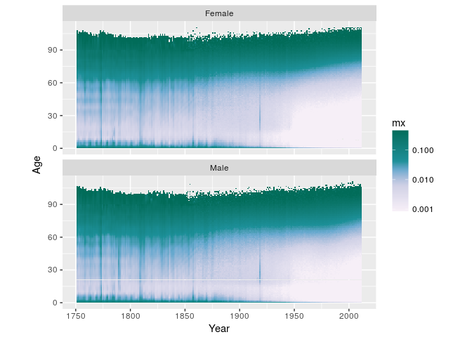

Divergent Colour Scales: Plotting Differences & Proportions
-----------------------------------------------------------

``` r
breaks_prop_mx <- c(0, 0.5, 0.7, 0.9, 1.1, 1.3, 1.5, Inf)
swe %>%
  mutate(Year = Year + 0.5, Age = Age + 0.5) %>%
  select(-Dx, -Nx) %>%
  tidyr::spread(key = Sex, value = mx) %>%
  mutate(fm_prop_mx = Female / Male,
         fm_prop_mx_disc = cut(fm_prop_mx, breaks_prop_mx)) %>%
  ggplot() +
  geom_tile(aes(x = Year, y = Age, fill = fm_prop_mx_disc)) +
  scale_fill_brewer(type = "div", palette = 5, direction = -1) +
  guides(fill = guide_legend(reverse = TRUE)) +
  coord_equal() +
  theme_dark()
```

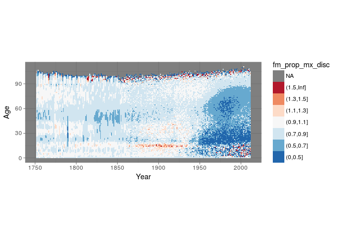

Continuous variant.

``` r
swe %>%
  mutate(Year = Year + 0.5, Age = Age + 0.5) %>%
  select(-Dx, -Nx) %>%
  tidyr::spread(key = Sex, value = mx) %>%
  mutate(fm_diff_mx = Female / Male) %>%
  ggplot() +
  geom_tile(aes(x = Year, y = Age, fill = fm_diff_mx)) +
  # takes 6 colours from a brewer palette and interpolates
  scale_fill_distiller(type = "div",
                       palette = "RdBu",
                       trans = "log2",
                       limits = c(0.5, 2),
                       oob = scales::squish) +
  coord_equal()
```

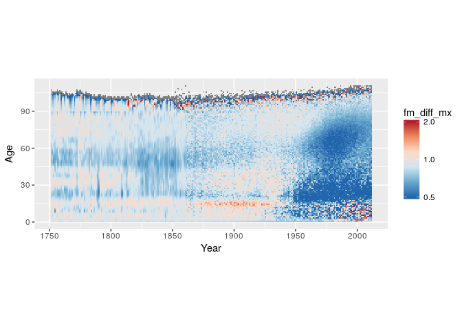

Qualitative Colour Scales: Plotting Group Membership
----------------------------------------------------

``` r
cod %>%
  mutate(Year = Year + 0.5, Age = Age + w/2) %>%
  ggplot() +
  geom_tile(aes(x = Year, y = Age, height = w, fill = COD)) +
  coord_equal() +
  facet_wrap(~Sex, ncol = 2)
```

    ## Warning: Ignoring unknown aesthetics: height


Using area instead of colour
----------------------------

Let's plot a surface of the number of deaths by age. Instead of color as primary visual encoding we draw points of varying size.

``` r
swe %>%
  filter(Sex == "Female") %>%
  mutate(Year = Year + 0.5, Age = Age + 0.5) %>%
  ggplot(aes(x = Year, y = Age)) +
  geom_point(aes(size = Dx))
```

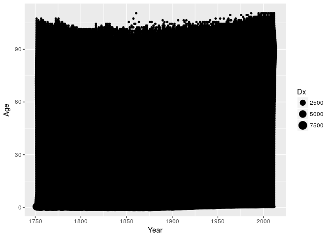

Not helpful. We can set the shape of the points to an open circle to clean up a bit.

``` r
swe %>%
  filter(Sex == "Female") %>%
  mutate(Year = Year + 0.5, Age = Age + 0.5) %>%
  ggplot(aes(x = Year, y = Age)) +
  geom_point(aes(size = Dx), shape = 1)
```

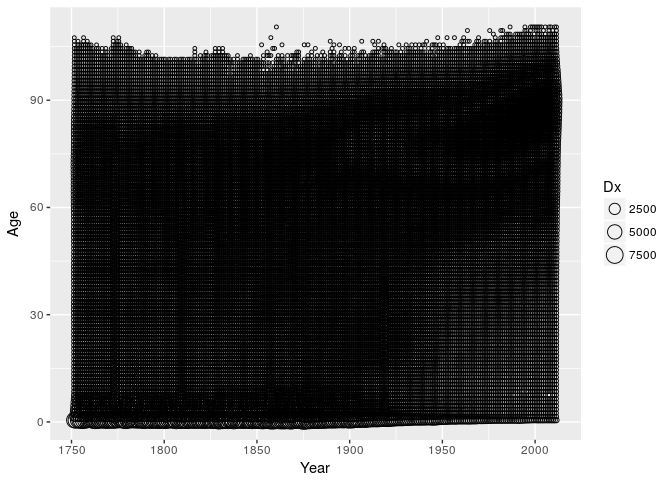

Still not good. Maybe reducing the number of circles would work. In order to do so we need to aggregate the data into wider period and age groups. For simple aggregations we can use the *summary2d* feature in ggplot. It cuts up the area of the plot into larger bins and performs a summary operation on the data in each bin. We will sum up the death counts in each 5x5 year square.

``` r
swe %>%
  filter(Sex == "Female") %>%
  mutate(Year = Year + 0.5, Age = Age + 0.5) %>%
  ggplot(aes(x = Year, y = Age)) +
  geom_point(aes(z = Dx, size = ..value..), shape = 1,
             stat = "summary2d",
             binwidth = c(5, 5),
             fun = sum)
```

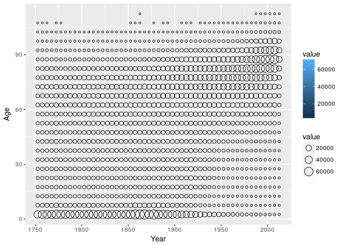

Change the size scale to area.

``` r
swe %>%
  filter(Sex == "Female") %>%
  mutate(Year = Year + 0.5, Age = Age + 0.5) %>%
  ggplot(aes(x = Year, y = Age)) +
  geom_point(aes(z = Dx, size = ..value..), shape = 1,
             stat = "summary2d",
             binwidth = c(5, 5),
             fun = sum) +
  scale_size_area()
```


Colour the points.

``` r
swe %>%
  filter(Sex == "Female") %>%
  mutate(Year = Year + 0.5, Age = Age + 0.5) %>%
  ggplot(aes(x = Year, y = Age)) +
  geom_point(aes(z = Dx, size = ..value.., colour = ..value..),
             stat = "summary2d",
             binwidth = c(5, 5),
             fun = sum) +
  scale_size_area() +
  theme_classic()
```

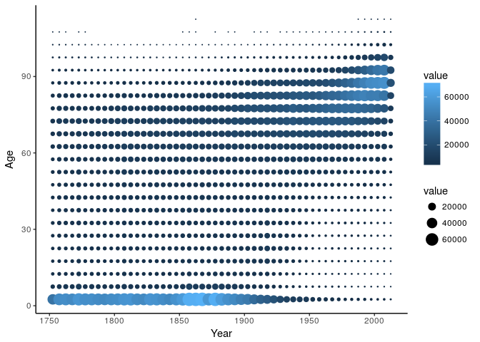

Further Reading
---------------

-   [Brilliant color advice from NASA](earthobservatory.nasa.gov/blogs/elegantfigures/2013/08/05/subtleties-of-color-part-1-of-6)
-   [Color scale generator](http://vrl.cs.brown.edu/color)
-   [Color scales for data-viz](colorbrewer2.org)
-   Brewer, Cynthia A. 1994. “Guidelines for Use of the Perceptual Dimensions of Color for Mapping and Visualization.” In SPIE, edited by Jan Bares, 2171:54–63. <doi:10.1117/12.175328>.

``` r
sessionInfo()
```

    ## R version 3.4.0 (2017-04-21)
    ## Platform: x86_64-pc-linux-gnu (64-bit)
    ## Running under: Ubuntu 16.04.2 LTS
    ## 
    ## Matrix products: default
    ## BLAS: /usr/lib/libblas/libblas.so.3.6.0
    ## LAPACK: /usr/lib/lapack/liblapack.so.3.6.0
    ## 
    ## locale:
    ##  [1] LC_CTYPE=en_US.UTF-8       LC_NUMERIC=C              
    ##  [3] LC_TIME=en_US.UTF-8        LC_COLLATE=en_US.UTF-8    
    ##  [5] LC_MONETARY=en_US.UTF-8    LC_MESSAGES=en_US.UTF-8   
    ##  [7] LC_PAPER=en_US.UTF-8       LC_NAME=C                 
    ##  [9] LC_ADDRESS=C               LC_TELEPHONE=C            
    ## [11] LC_MEASUREMENT=en_US.UTF-8 LC_IDENTIFICATION=C       
    ## 
    ## attached base packages:
    ## [1] stats     graphics  grDevices utils     datasets  methods   base     
    ## 
    ## other attached packages:
    ## [1] dplyr_0.5.0     purrr_0.2.2.2   readr_1.1.1     tidyr_0.6.3    
    ## [5] tibble_1.3.3    ggplot2_2.2.1   tidyverse_1.1.1
    ## 
    ## loaded via a namespace (and not attached):
    ##  [1] Rcpp_0.12.11       RColorBrewer_1.1-2 cellranger_1.1.0  
    ##  [4] compiler_3.4.0     plyr_1.8.4         forcats_0.2.0     
    ##  [7] tools_3.4.0        digest_0.6.12      lubridate_1.6.0   
    ## [10] jsonlite_1.4       evaluate_0.10      nlme_3.1-131      
    ## [13] gtable_0.2.0       lattice_0.20-35    rlang_0.1.1       
    ## [16] psych_1.7.5        DBI_0.6-1          yaml_2.1.14       
    ## [19] parallel_3.4.0     haven_1.0.0        xml2_1.1.1        
    ## [22] httr_1.2.1         stringr_1.2.0      knitr_1.16        
    ## [25] hms_0.3            rprojroot_1.2      grid_3.4.0        
    ## [28] R6_2.2.1           readxl_1.0.0       foreign_0.8-67    
    ## [31] rmarkdown_1.5      modelr_0.1.0       reshape2_1.4.2    
    ## [34] magrittr_1.5       backports_1.1.0    scales_0.4.1      
    ## [37] htmltools_0.3.6    rvest_0.3.2        assertthat_0.2.0  
    ## [40] mnormt_1.5-5       colorspace_1.3-2   labeling_0.3      
    ## [43] stringi_1.1.5      lazyeval_0.2.0     munsell_0.4.3     
    ## [46] broom_0.4.2

cc-by Jonas Schöley 2017
